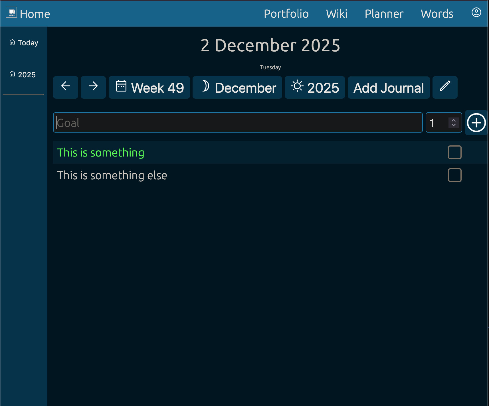
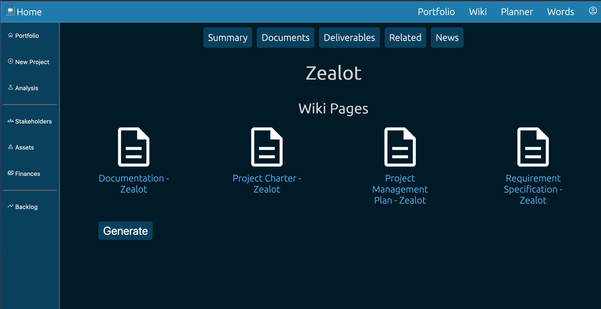
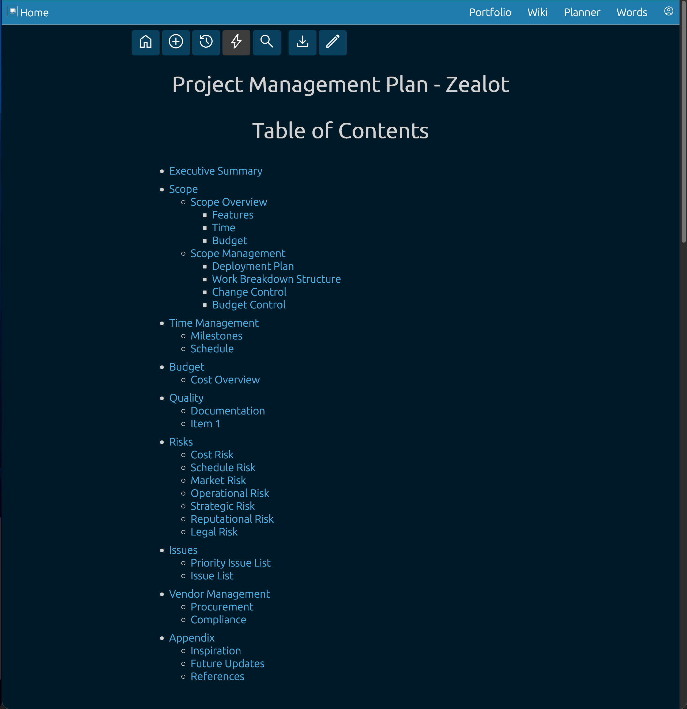
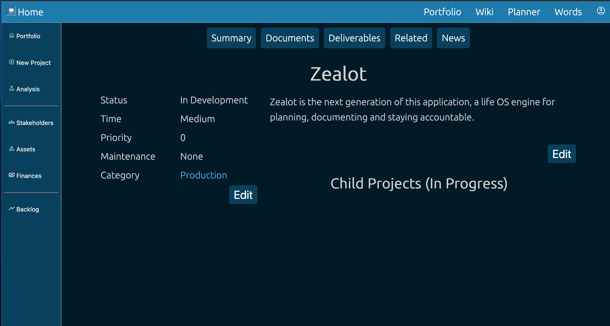

# Scheduler 1

Scheduler is the first version of the planner, wiki and portfolio tool I personally use. It runs as a full stack application, and supports docker!

# Get Started

Scheduler 1 can be configured by:

- Running in Docker
- Running manually

## Running in Docker

A [docker-compose.yml](./Dev/docker-compose.yml) file is available for deploying automatically in Docker Compose or Swarm.

To deploy:

```bash
cd Dev

# If you haven't already initialized docker swarm
docker swarm init 

# Deploy the stack
docker stack deploy -c docker-compose.yml scheduler1
```

This docker-compose file runs the frontend on port 16789. If you were running locally, you can reach at http://localhost:16789

## Manual Setup

Manual set up involves the following:

1. Setting up a Redis Server for Session Management
2. Setting up a postgres database, seeding it with Data/init.sql
3. Running the application with npm start

Scripts for ease of starting and stopping the Redis server have been included in end.sh, start.sh and restart.sh

# Screenshots

Planner


Portfolios


Wiki and Projects


Personal wiki hooked up to projects


Project Screen
